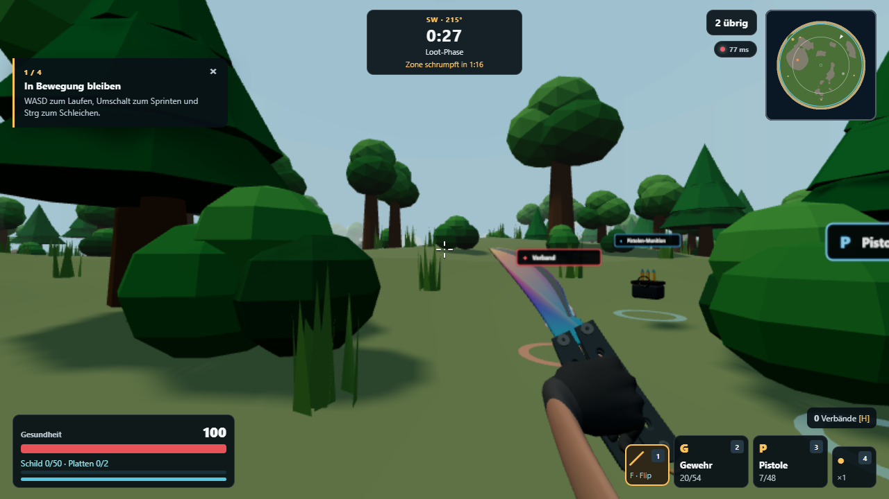
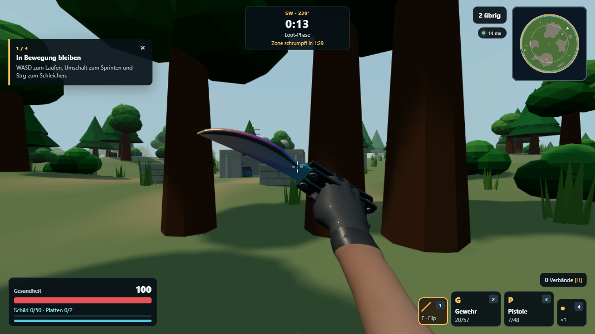
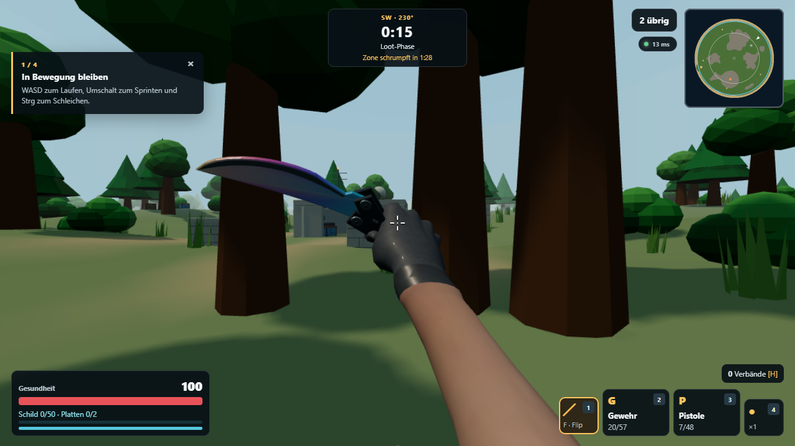
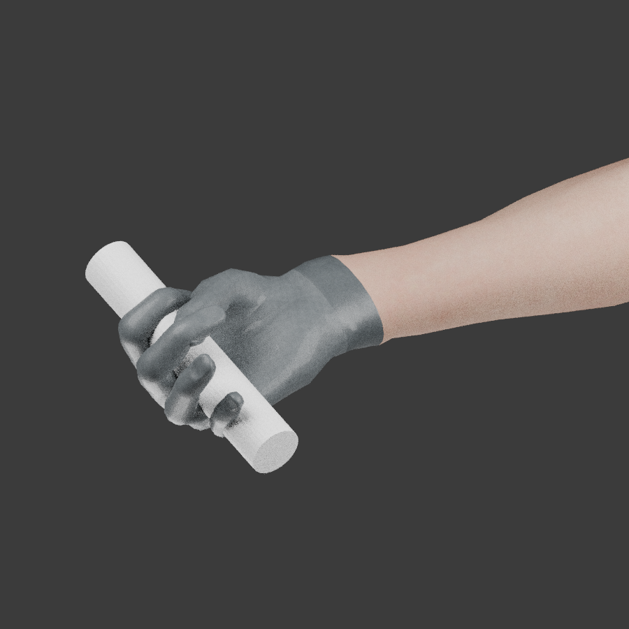
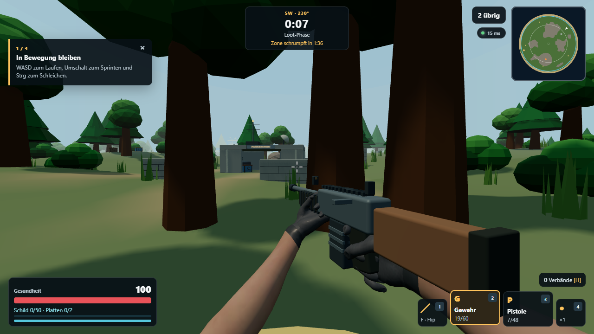
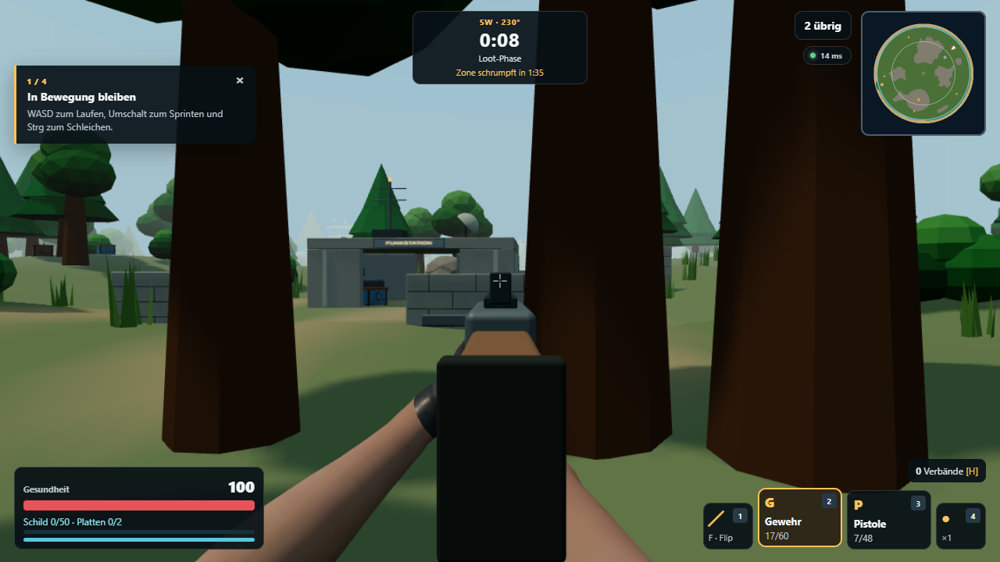
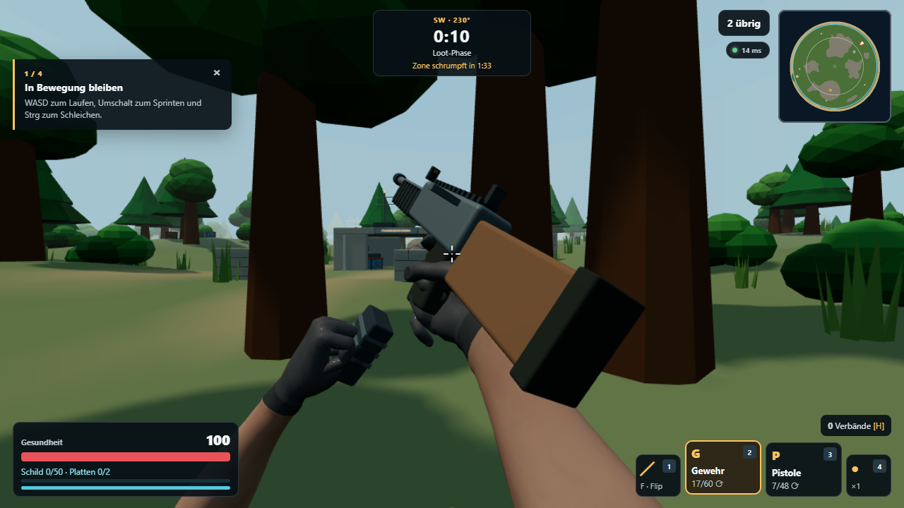
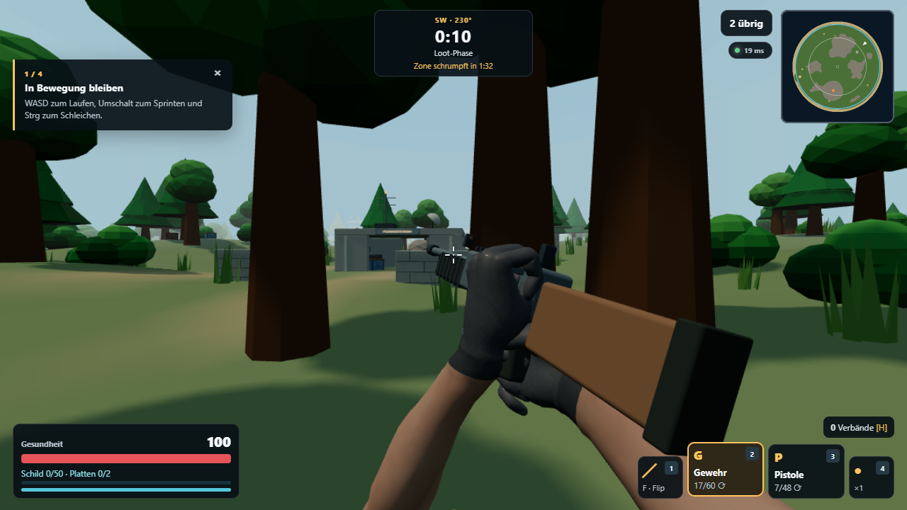

# First-person hand and grip review

Visual references (linked only; no external game assets are shipped):

- [Counter-Strike 2 butterfly knife and gloves](https://steamcommunity.com/sharedfiles/filedetails/?id=3579746353): forearm and wrist continue smoothly into the gripping hand, the blade rests diagonally ahead of the knuckles, and the handle sits inside the fingers.
- [VALORANT knife view](https://staticg.sportskeeda.com/editor/2024/07/15581-17207902224356-1920.jpg?w=640): both hands enter from the lower edge and leave the central aiming view clear.

The user-provided knife and rifle screenshots add three targets: a larger glove in the first-person frame, clearly shaped knuckles and a padded cuff, and a support hand visibly wrapped around the rifle fore-end.

| Check | Previous in-game capture | Revised in-game capture |
| --- | --- | --- |
| Knife idle |  |  |

The previous forearm was stretched and swept sideways by vertex coordinates after posing. The revised export preserves its original length and cross-section and bends it through the source bone weights. The handle is aligned with a grip socket inside the curled fingers. The larger knife view and raised leather cuff give the glove more of the screen coverage in the user's reference; the sculpted knuckle contours and restrained material grain keep the glove a continuous surface.

The lower fingers loosen during the butterfly inspect animation and close around both handles again at rest:

The Blender inspection below shows the posed anatomical fingers wrapping a grip-sized cylinder before the knife is placed in-game:

The same hand export is used on firearms. In the rifle hip view the left support hand wraps around the fore-end, while aiming keeps the sights clear and routes the elbow below the frame:

During reload the left hand follows the moving magazine with a closed grip,
then moves to the left-side charging handle. Each phase has its own finger
pose and keeps the forearm entering from the lower edge:

All in-game images are 1280 × 720 Playwright captures from `tests/browser/gameplay-upgrade.spec.ts`. The grip inspection is rendered from the same baked mesh by `scripts/blender/build_view_hands.py`. The supplied references show higher-detail commercial assets; this review checks pose, proportions, grip contact and screen coverage. The glove and rifle still use the game's simpler art style.
